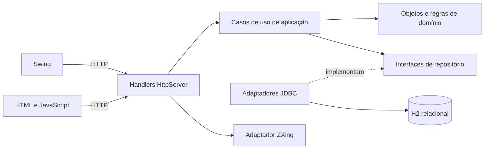
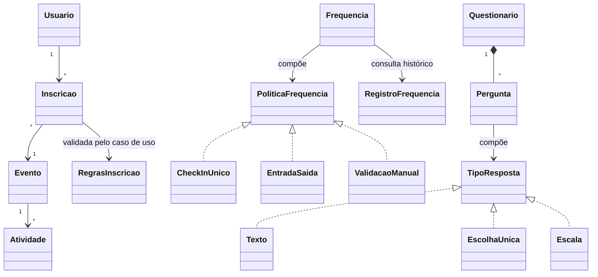

# Domínio e arquitetura

## Vocabulário e responsabilidades

| Conceito | Responsabilidade |
|---|---|
| Usuario | Nome, e-mail, hash, papel e validação do perfil; autenticação da senha |
| Evento | Período, local, fuso e transições rascunho → publicado → encerrado |
| Atividade | Tipo aberto, trilha, local, período e capacidade; detectar sobreposição |
| VinculoPessoa | Relação entre pessoa e atividade com papel como palestrante |
| Inscricao | Escolhas do participante e transição para cancelada |
| RegrasInscricao | Objeto de valor imutável com escolha, controle de vagas e prazo |
| Frequencia | Calcular presença a partir da estratégia e histórico; validar duplicidade/ordem |
| PoliticaFrequencia | Contrato para check-in único, entrada/saída ou conferência manual |
| RegistroFrequencia | Fato imutável com origem, responsável, instante UTC e justificativa |
| CodigoFrequencia | Token opaco associado à operação, com instante de expiração |
| Questionario | Agregado imutável que exige respostas para suas perguntas |
| Pergunta / TipoResposta | Composição que valida texto, escolha única ou escala por polimorfismo |
| Avaliacao | Respostas identificadas por participante e instante; uma por questionário |

## Fluxo de dependências

`ServidorApi` constrói as dependências explicitamente. Não existe contêiner de injeção. Domínio e aplicação não importam HTTP, Swing, JDBC ou JSON. Handlers traduzem entradas e saídas; operações simples de eventos/perfil ainda podem coordenar chamadas curtas, sem uma classe por endpoint. Casos de uso com regras entre agregados ficam em `application`.

A relação inscrição/atividade é uma seleção persistida por IDs. A agenda não é outra tabela: deriva das seleções válidas. Não há subclasses de atividade apenas para distinguir palestra e oficina; o tipo é texto configurável. Não é necessário forçar herança de entidades.

## Persistência e consistência

`src/main/resources/db/001-inicial.sql` cria a base original; `002-politicas.sql` acrescenta configurações, frequência e avaliação. São scripts idempotentes aditivos. `ConnectionFactory` os aplica na primeira conexão de cada URL de banco no processo. Não é um sistema genérico de migração com checksum; futuras alterações devem manter a compatibilidade e ganhar novo script explícito.

Inscrição e escolhas são gravadas em transação; questionário e perguntas/opções também; avaliação e respostas também. `UNIQUE(questionario_id, usuario_id)` impede avaliações duplicadas. Requisições da API são executadas sequencialmente em um processo, e o caso de uso de inscrição também serializa reserva/alteração de vagas. Esta solução não oferece coordenação entre múltiplas instâncias da API — fora do recorte da demonstração local.

O estado do evento limita a leitura pública. Administradores e organizadores formam a organização global desta instalação acadêmica e podem operar os eventos; não existe separação por proprietário de evento. Participantes operam seus próprios registros. Os relatórios e respostas identificadas são restritos à organização.

Datas de programação são horários locais associados ao fuso IANA do evento. Agenda e conflito entre eventos comparam instantes. Registros de frequência e avaliações guardam UTC. O fuso é fixado na criação do evento para não reinterpretar o histórico.
