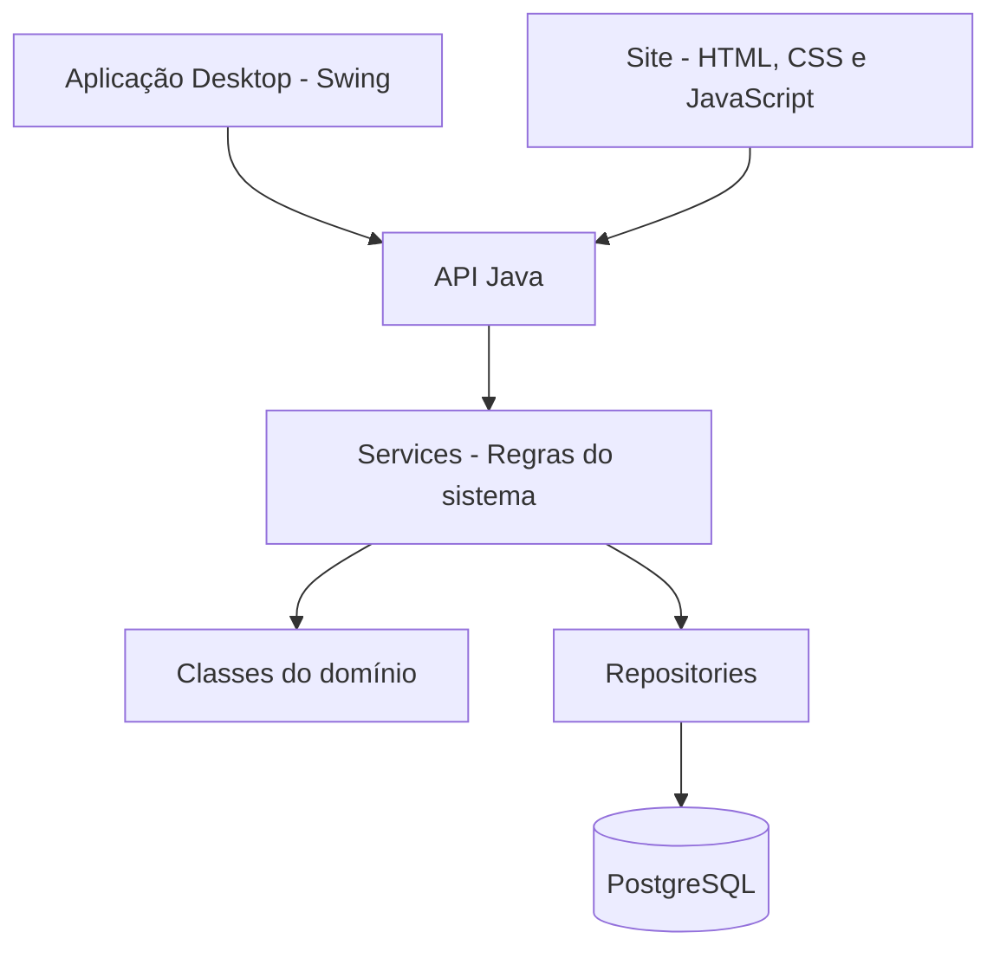
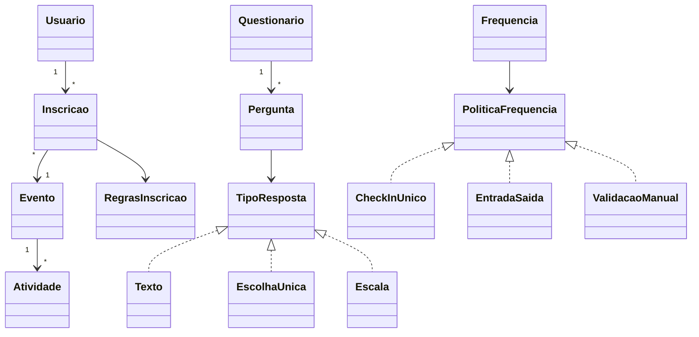

# Domínio e arquitetura

## 1. Sobre o projeto

O projeto é um sistema de gerenciamento de eventos desenvolvido em Java. Ele permite cadastrar eventos, atividades e participantes, realizar inscrições, controlar a frequência e consultar relatórios.

O sistema possui duas interfaces:

- **Desktop (Java Swing):** utilizada pelos administradores e organizadores para gerenciar os eventos.
- **Site (HTML, CSS e JavaScript):** utilizado pelos participantes para consultar eventos, realizar inscrições e registrar presença.

As duas interfaces se comunicam com a mesma API Java, que contém as regras do sistema e acessa o banco de dados PostgreSQL.

## 2. Principais classes e responsabilidades

As classes foram organizadas de acordo com as funcionalidades do sistema.

| Classe | Responsabilidade |
|---|---|
| Usuario | Armazena os dados do usuário e suas permissões. |
| Evento | Representa um evento e controla sua publicação e encerramento. |
| Atividade | Representa uma atividade, seus horários, local e quantidade de vagas. |
| Inscricao | Representa a inscrição de um participante em um evento. |
| RegrasInscricao | Define as regras de inscrição, como prazo e controle de vagas. |
| Frequencia | Controla e verifica a presença dos participantes. |
| PoliticaFrequencia | Define a forma de registrar a presença. |
| Questionario | Representa o questionário de avaliação de uma atividade. |
| Pergunta | Representa uma pergunta do questionário. |
| Avaliacao | Armazena as respostas enviadas pelos participantes. |

## 3. Arquitetura do sistema

O sistema foi dividido em camadas para separar as responsabilidades e facilitar a manutenção do código.

```mermaid
flowchart TD
    Desktop[Aplicação Desktop - Swing] --> API[API Java]
    Site[Site - HTML, CSS e JavaScript] --> API
    API --> Service[Services - Regras do sistema]
    Service --> Dominio[Classes do domínio]
    Service --> Repository[Repositories]
    Repository --> Banco[(PostgreSQL)]
```

Cada parte possui uma função:

- **Interfaces:** mostram as informações e recebem as ações dos usuários.
- **API:** recebe as requisições do desktop e do site.
- **Services:** executam as funcionalidades e verificam as regras de negócio.
- **Domínio:** contém as classes e os comportamentos dos objetos.
- **Repositories:** realizam as operações de consulta e gravação no banco.
- **Banco de dados:** armazena os dados dos eventos, usuários, inscrições e demais informações.

Essa divisão permite utilizar as mesmas regras tanto no desktop quanto no site.

## 4. Diagrama de classes

O diagrama abaixo apresenta algumas das principais relações entre as classes do sistema.

```mermaid
classDiagram
    Usuario "1" --> "*" Inscricao
    Evento "1" --> "*" Atividade
    Inscricao "*" --> "1" Evento
    Inscricao --> RegrasInscricao
    Frequencia --> PoliticaFrequencia
    Questionario "1" --> "*" Pergunta
    Pergunta --> TipoResposta

    PoliticaFrequencia <|.. CheckInUnico
    PoliticaFrequencia <|.. EntradaSaida
    PoliticaFrequencia <|.. ValidacaoManual

    TipoResposta <|.. Texto
    TipoResposta <|.. EscolhaUnica
    TipoResposta <|.. Escala
```

## 5. Conceitos de POO utilizados

Durante o desenvolvimento, utilizamos conceitos de Programação Orientada a Objetos para organizar o código.

### Classes e objetos

Classes como `Usuario`, `Evento`, `Atividade` e `Inscricao` representam elementos do sistema.

Por exemplo, a classe `Evento` define as informações e os comportamentos de um evento. Cada evento cadastrado é um objeto dessa classe.

### Encapsulamento

As classes possuem métodos para controlar alterações em seus dados.

Por exemplo, a classe `Evento` possui regras para publicação e encerramento, evitando alterações que não sejam permitidas pelo estado atual do evento.

### Composição

Utilizamos composição quando uma classe precisa trabalhar com objetos de outras classes.

Por exemplo, `Questionario` possui perguntas, e `Frequencia` utiliza uma política para definir como a presença será registrada.

### Interfaces e polimorfismo

A interface `PoliticaFrequencia` permite trabalhar com diferentes formas de registrar presença:

- `CheckInUnico`
- `EntradaSaida`
- `ValidacaoManual`

Cada implementação possui seu próprio comportamento, mas todas seguem o mesmo contrato.

Também utilizamos esse conceito nos tipos de resposta dos questionários: texto, escolha única e escala.

### Herança

A herança não foi utilizada em todas as classes, pois nem sempre era necessária.

Por exemplo, não criamos uma classe diferente para cada tipo de atividade, como palestra ou oficina. Utilizamos a classe `Atividade` com um atributo que identifica seu tipo.

Nos casos em que precisamos variar o comportamento, utilizamos interfaces e composição.

## 6. Organização do código

O projeto separa as classes de acordo com suas responsabilidades.

| Parte | Exemplo |
|---|---|
| Domínio | `Evento`, `Atividade`, `Usuario` |
| Serviços | `EventoService`, `AtividadeService`, `InscricaoService` |
| Interfaces de repositório | `EventoRepository`, `AtividadeRepository` |
| Acesso ao banco | `EventoRepositoryJdbc`, `AtividadeRepositoryJdbc` |
| API | `EventoHttpHandler`, `AtividadeHttpHandler` |

Por exemplo, ao cadastrar uma atividade:

1. O desktop envia os dados para a API.
2. A API recebe os dados pelo `AtividadeHttpHandler`.
3. O `AtividadeService` verifica as regras da atividade.
4. O `AtividadeRepositoryJdbc` salva os dados no PostgreSQL.
5. A API retorna o resultado para o desktop.

## 7. Considerações finais

A arquitetura foi organizada para separar as regras de negócio das interfaces e do banco de dados.

Com isso, o desktop e o site utilizam as mesmas funcionalidades pela API, evitando repetir regras em diferentes partes do sistema.

Os conceitos de POO foram utilizados principalmente nas classes do domínio, nos serviços, nas interfaces e nas diferentes implementações de comportamento.
