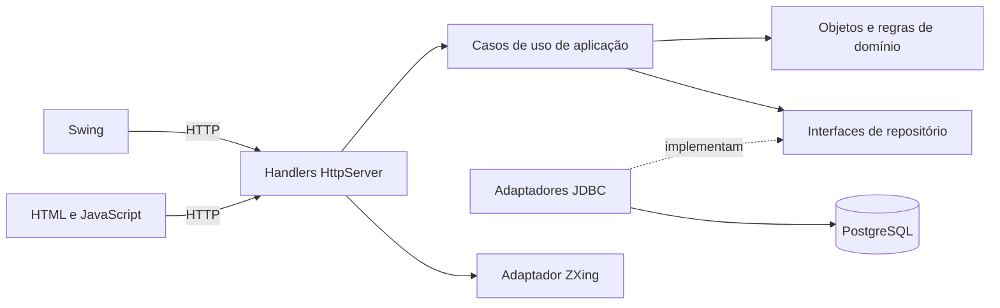
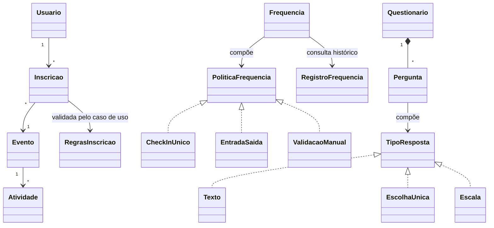

# Domínio e arquitetura

## Vocabulário e responsabilidades

| Conceito | Responsabilidade |
|---|---|
| Usuario | Nome, e-mail, hash, papel e validação do perfil; autenticação da senha |
| Evento | Período, local, fuso e transições rascunho → publicado → encerrado |
| Atividade | Tipo aberto, trilha, local, período e capacidade; detectar sobreposição |
| VinculoPessoa | Relação entre pessoa e atividade com papel como palestrante |
| Inscricao | Escolhas do participante e transição para cancelada |
| RegrasInscricao | Objeto de valor imutável com escolha, controle de vagas e prazo |
| Frequencia | Calcular presença a partir da estratégia e histórico; validar duplicidade/ordem |
| PoliticaFrequencia | Contrato para check-in único, entrada/saída ou conferência manual |
| RegistroFrequencia | Fato imutável com origem, responsável, instante UTC e justificativa |
| CodigoFrequencia | Token opaco associado à operação, com instante de expiração |
| Questionario | Agregado imutável que exige respostas para suas perguntas |
| Pergunta / TipoResposta | Composição que valida texto, escolha única ou escala por polimorfismo |
| Avaliacao | Respostas identificadas por participante e instante; uma por questionário |

## Fluxo de dependências

```mermaid
flowchart LR
  Desktop[Swing] -->|HTTP| API[Handlers HttpServer]
  Web[HTML e JavaScript] -->|HTTP| API
  API --> Casos[Casos de uso de aplicação]
  Casos --> Dominio[Objetos e regras de domínio]
  Casos --> Portas[Interfaces de repositório]
  JDBC[Adaptadores JDBC] -. implementam .-> Portas
  JDBC --> PostgreSQL[(PostgreSQL)]
  API --> QR[Adaptador ZXing]
```

`ServidorApi` constrói as dependências explicitamente. Não existe contêiner de injeção. Domínio e aplicação não importam HTTP, Swing, JDBC ou JSON. Todos os handlers reutilizam `Endpoint` para o tratamento HTTP comum e traduzem apenas entradas e saídas. Casos de uso e regras que combinam entidades ou repositórios ficam nos services de `application`.

As interfaces são divididas por público, não por regras: o **desktop Swing** atende administrador e organizador; o **site** atende visitante e participante. A **API** é a única entrada para regras de negócio, permissões e persistência. Assim, as telas podem ser diferentes sem duplicar validações ou acessar o banco diretamente.

```mermaid
classDiagram
  Evento "1" --> "*" Atividade
  Usuario "1" --> "*" Inscricao
  Inscricao "*" --> "1" Evento
  Inscricao --> RegrasInscricao : validada pelo caso de uso
  Frequencia --> PoliticaFrequencia : compõe
  Frequencia --> RegistroFrequencia : consulta histórico
  PoliticaFrequencia <|.. CheckInUnico
  PoliticaFrequencia <|.. EntradaSaida
  PoliticaFrequencia <|.. ValidacaoManual
  Questionario "1" *-- "*" Pergunta
  Pergunta --> TipoResposta : compõe
  TipoResposta <|.. Texto
  TipoResposta <|.. EscolhaUnica
  TipoResposta <|.. Escala
```
